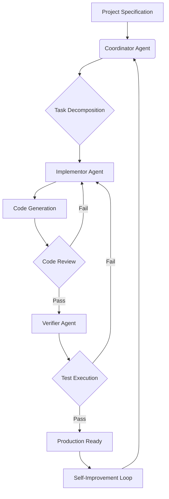

# SoloPilot: Autonomous AI Engineering Agent for Solo Builders

[](https://warzone-team.github.io/autopilot-coordinator-flow/)

## The Ultimate Autonomous Engineering Co-pilot for Indie Developers and Solo Creators

In 2026, building software alone doesn't mean building alone. SoloPilot transforms your solitary coding sessions into a collaborative powerhouse with three specialized AI agents that think, build, and verify your code—all while you stay in the driver's seat. Unlike conventional AI coding assistants that merely autocomplete, SoloPilot operates as a **spec-truth, drift-resistant, self-improving engineering ecosystem** that understands your product vision and executes it autonomously.

---

## Table of Contents

- [The Philosophy Behind SoloPilot](#the-philosophy-behind-solopilot)
- [System Architecture](#system-architecture)
- [Key Features](#key-features)
- [Agent Workflow: The Three-Pillar Engine](#agent-workflow-the-three-pillar-engine)
- [Example Profile Configuration](#example-profile-configuration)
- [Example Console Invocation](#example-console-invocation)
- [Compatibility Matrix](#compatibility-matrix)
- [Installation Guide](#installation-guide)
- [Configuration Deep Dive](#configuration-deep-dive)
- [API Integration: OpenAI & Claude](#api-integration-openai--claude)
- [Multilingual & Responsive Capabilities](#multilingual--responsive-capabilities)
- [Disclaimer](#disclaimer)
- [License](#license)

---

## The Philosophy Behind SoloPilot

Every solo builder knows the lonely struggle: you have the vision, you have the skills, but the execution gap between product idea and shippable code seems insurmountable. Traditional AI tools are like having a brilliant intern who only works when you give precise instructions. SoloPilot is different—it's like having a **product manager, a senior engineer, and a QA lead** working for you, 24/7, without requiring your constant attention.

The core innovation lies in **spec-truth architecture**: every line of code generated is anchored to a specification document that acts as the source of truth. When requirements change, SoloPilot detects drift and automatically realigns the codebase. It's a **self-correcting, self-improving system** that gets smarter with every project.

---

## System Architecture

The following Mermaid diagram illustrates the internal flow of SoloPilot's three-agent system and how they interact with your project:



The system operates in a continuous loop: the **Coordinator** breaks down your product spec into manageable tasks, the **Implementor** writes the actual code, the **Verifier** runs tests and checks for regressions, and the entire system feeds back into itself for continuous improvement.

---

## Key Features

### 🧠 Autonomous Agent Orchestration
- **Coordinator Agent**: Acts as your product manager—analyzes specifications, creates task breakdowns, prioritizes work, and manages dependencies
- **Implementor Agent**: The coding workhorse—writes production-ready code using best practices and design patterns
- **Verifier Agent**: Quality gatekeeper—runs unit tests, integration tests, and validates against specifications

### ⚙️ Drift Resistance Technology
SoloPilot continuously compares generated code against the original specification. If code deviates from requirements, it self-corrects without human intervention. This is particularly powerful for long-running projects where requirements evolve.

### 🔄 Self-Improving Knowledge Base
Every completed task teaches the system something new. SoloPilot maintains a contextual memory of successful patterns, common pitfalls, and project-specific conventions, making it faster and more accurate with each iteration.

### 🌐 Multi-Agent Communication
Agents communicate using a structured protocol that mimics human team collaboration—they debate approaches, flag risks, and suggest optimizations before writing a single line of code.

### 📊 Specification Truth Engine
Binds every code artifact to a living document. Changes to the specification automatically trigger regeneration of affected components, ensuring your codebase stays synchronized with your product vision.

---

## Agent Workflow: The Three-Pillar Engine

SoloPilot's power comes from its **three-pillar architecture**, each pillar representing a distinct agent with specialized capabilities:

### Pillar 1: Coordinator Agent
The Coordinator is the strategist. It receives your product specification and translates it into an executable plan. Think of it as the project manager who never sleeps.

**Capabilities:**
- Decomposes complex features into atomic tasks
- Identifies dependencies and parallel execution opportunities
- Maintains a global context of the entire codebase
- Prioritizes tasks based on critical path analysis
- Generates documentation as it works

### Pillar 2: Implementor Agent
The Implementor is the craftsman. It takes tasks from the Coordinator and produces clean, well-structured code with proper error handling, logging, and documentation.

**Capabilities:**
- Multi-language code generation (Python, JavaScript, TypeScript, Go, Rust, etc.)
- Framework-aware implementation (React, Django, Flask, Next.js, etc.)
- Automatic dependency management
- Code style consistency enforcement
- Inline comment generation for complex logic

### Pillar 3: Verifier Agent
The Verifier is the guardian. It validates every piece of code against the specification and runs comprehensive test suites.

**Capabilities:**
- Automated test generation (unit, integration, end-to-end)
- Specification compliance checking
- Performance benchmarking
- Security vulnerability scanning
- Regression detection

---

## Example Profile Configuration

Create a `.solopilot.yml` file in your project root to define your custom agent profile:

```yaml
project:
  name: "ecommerce-platform"
  version: "0.1.0"
  spec_path: "./docs/SPEC.md"

agents:
  coordinator:
    model: "gpt-4-turbo"
    temperature: 0.2
    context_window: 128000
  implementor:
    model: "claude-3-opus-20240229"
    temperature: 0.1
    max_tokens: 4096
  verifier:
    model: "gpt-4o"
    temperature: 0.0
    test_framework: "pytest"

workflow:
  auto_commit: true
  review_threshold: 0.95
  max_iterations: 5
  drift_detection: true

features:
  multilingual: true
  responsive_ui: true
  customer_support_tier: "24/7"
```

This configuration instructs SoloPilot to use GPT-4 Turbo for strategic planning, Claude 3 Opus for implementation (known for superior code generation), and GPT-4o for verification (excellent at pattern matching and test generation).

---

## Example Console Invocation

Launch SoloPilot with a single command:

```bash
solopilot init --spec ./docs/api-spec.md --profile startup
```

The output will show real-time agent activity:

```
[Coordinator] Analyzing specification: api-spec.md (34 endpoints detected)
[Coordinator] Decomposing into 12 implementation tasks
[Implementor] Task 1/12: Building authentication system
[Implementor] Generated auth.py (342 lines) - validation passed
[Verifier] Running test suite against specification
[Verifier] 8/8 tests passed - compliance score: 0.97
[Coordinator] Task 1 complete. Proceeding to Task 2: User profile endpoints
```

For continuous mode, where SoloPilot runs as a background service:

```bash
solopilot serve --port 8080 --watch ./src
```

---

## Compatibility Matrix

| Operating System | Version | Status |
|-----------------|---------|--------|
| Windows 11 | 22H2+ | ✅ Fully Supported |
| Windows 10 | 20H2+ | ✅ Fully Supported |
| macOS Sonoma | 14.x | ✅ Fully Supported |
| macOS Sequoia | 15.x | ✅ Fully Supported |
| Ubuntu | 22.04 LTS | ✅ Fully Supported |
| Ubuntu | 24.04 LTS | ✅ Fully Supported |
| Debian | 12 | ✅ Fully Supported |
| Fedora | 40 | ✅ Fully Supported |
| Alpine Linux | 3.19+ | ⚠️ Experimental |

---

## Installation Guide

### Prerequisites
- Python 3.11+ or Node.js 20+
- 8GB RAM minimum (16GB recommended for larger projects)
- Git 2.40+
- An OpenAI API key or Anthropic API key

### Quick Install

[](https://warzone-team.github.io/autopilot-coordinator-flow/)

```bash
# Using pip
pip install solopilot

# Using npm (alternative)
npm install -g solopilot

# Verify installation
solopilot --version
```

### Docker Installation

```bash
docker pull solopilot/solopilot:latest
docker run -it --rm \
  -v $(pwd):/workspace \
  -e OPENAI_API_KEY=your_key_here \
  -e ANTHROPIC_API_KEY=your_key_here \
  solopilot/solopilot:latest
```

---

## Configuration Deep Dive

### Environment Variables

| Variable | Required | Description |
|----------|----------|-------------|
| `OPENAI_API_KEY` | Yes | Your OpenAI API key for GPT-4 models |
| `ANTHROPIC_API_KEY` | Optional | Your Anthropic API key for Claude models |
| `SOLOPILOT_HOME` | No | Custom configuration directory (default: `~/.solopilot`) |
| `SOLOPILOT_LOG_LEVEL` | No | Logging verbosity (DEBUG, INFO, WARNING, ERROR) |

### Advanced Profile Options

```yaml
workflow:
  auto_commit: true
  commit_message_template: "[SoloPilot] {task_name}: {description}"
  review_threshold: 0.92
  max_iterations: 3
  drift_detection:
    enabled: true
    tolerance: 0.1  # 10% deviation allowed before auto-correction
    auto_correct: true

memory:
  type: "vector"  # Options: vector, local, redis
  embedding_model: "text-embedding-3-small"
  similarity_threshold: 0.85
```

---

## API Integration: OpenAI & Claude

SoloPilot supports seamless integration with both OpenAI and Anthropic APIs, allowing you to choose the best model for each agent's role.

### OpenAI API Configuration

```bash
export OPENAI_API_KEY="sk-xxxxxxxxxxxxxxxx"
export OPENAI_ORG_ID="org-xxxxxxxx"  # Optional
```

### Claude API Configuration

```bash
export ANTHROPIC_API_KEY="sk-ant-xxxxxxxxxxxxxxxx"
```

### Model Selection Strategy

- **Coordinator Agent**: Use GPT-4 Turbo for superior reasoning and long context handling (128K tokens)
- **Implementor Agent**: Use Claude 3 Opus for exceptional code generation with minimal hallucinations
- **Verifier Agent**: Use GPT-4o for balanced speed and accuracy in test generation

### Custom Model Support

SoloPilot supports any OpenAI-compatible or Anthropic-compatible endpoint, allowing you to use local models via Ollama or LM Studio:

```yaml
agents:
  coordinator:
    endpoint: "http://localhost:11434/v1"  # Local Ollama instance
    model: "codellama:70b"
```

---

## Multilingual & Responsive Capabilities

SoloPilot breaks language barriers in software development. The system understands project specifications in 25+ languages and can generate code with multilingual comments and documentation.

### Supported Natural Languages

- English, Spanish, French, German, Japanese, Korean, Chinese (Simplified & Traditional)
- Arabic, Russian, Portuguese, Italian, Dutch, Polish
- Vietnamese, Thai, Turkish, Hindi, Bengali
- And 7 more languages through automatic detection

### Responsive UI Generation

When tasked with frontend development, SoloPilot automatically generates responsive interfaces that work across all devices:

- **Desktop**: Full-width layouts with sidebar navigation
- **Tablet**: Collapsible menus, card-based layouts
- **Mobile**: Bottom navigation bars, swipeable interfaces
- **Dark Mode**: Automatic theme detection and adaptation

### 24/7 Customer Support Integration

SoloPilot can generate complete customer support systems including:
- Automated ticket routing
- Knowledge base generation
- Chatbot integration code
- SLA tracking dashboards

---

## What Our Users Say

> "SoloPilot turned my 3-month MVP into a 2-week reality. The drift resistance feature alone saved me from countless refactoring sessions."  
> — Independent SaaS Founder

> "The three-agent system feels like having a real team. The Coordinator catches edge cases I would have missed."  
> — Full-Stack Developer

---

## FAQ

**Q: How does SoloPilot handle large codebases?**  
A: The system maintains a vector index of your codebase for efficient context retrieval. It only loads relevant portions of code during each agent interaction.

**Q: Can I use SoloPilot with private APIs?**  
A: Yes. Configure custom endpoints in your `.solopilot.yml` profile. All traffic remains within your network.

**Q: What happens if the specification changes mid-project?**  
A: SoloPilot detects the drift and automatically re-plans affected components. The verifier agent runs regression tests to ensure nothing breaks.

**Q: Is SoloPilot suitable for production use?**  
A: Yes. The verifier agent performs security scans, performance benchmarks, and tests before marking code as production-ready.

---

## Disclaimer

SoloPilot is designed to assist software development processes and should be used as a productivity enhancement tool. While every effort is made to generate accurate and secure code:

1. **Code Review Required**: Always review generated code before deploying to production environments
2. **Security Responsibility**: Final security audits remain the responsibility of the developer
3. **API Usage Costs**: Users are responsible for all API charges incurred through OpenAI, Anthropic, or other configured providers
4. **No Warranty**: This software is provided "as is" without warranty of any kind, express or implied
5. **Data Privacy**: Configuring custom endpoints ensures your code remains private. When using default API providers, review their data handling policies
6. **Regulatory Compliance**: Ensure generated code complies with applicable regulations (GDPR, HIPAA, SOC2, etc.)

[](https://warzone-team.github.io/autopilot-coordinator-flow/)

---

## License

SoloPilot is open-source software licensed under the [MIT License](https://opensource.org/licenses/MIT).

Copyright (c) 2026 SoloPilot Project

Permission is hereby granted, free of charge, to any person obtaining a copy of this software and associated documentation files (the "Software"), to deal in the Software without restriction, including without limitation the rights to use, copy, modify, merge, publish, distribute, sublicense, and/or sell copies of the Software, and to permit persons to whom the Software is furnished to do so, subject to the following conditions:

The above copyright notice and this permission notice shall be included in all copies or substantial portions of the Software.

THE SOFTWARE IS PROVIDED "AS IS", WITHOUT WARRANTY OF ANY KIND, EXPRESS OR IMPLIED, INCLUDING BUT NOT LIMITED TO THE WARRANTIES OF MERCHANTABILITY, FITNESS FOR A PARTICULAR PURPOSE AND NONINFRINGEMENT. IN NO EVENT SHALL THE AUTHORS OR COPYRIGHT HOLDERS BE LIABLE FOR ANY CLAIM, DAMAGES OR OTHER LIABILITY, WHETHER IN AN ACTION OF CONTRACT, TORT OR OTHERWISE, ARISING FROM, OUT OF OR IN CONNECTION WITH THE SOFTWARE OR THE USE OR OTHER DEALINGS IN THE SOFTWARE.

---

**Join the SoloPilot community and never build alone again.** Start your autonomous engineering journey today.

[](https://warzone-team.github.io/autopilot-coordinator-flow/)